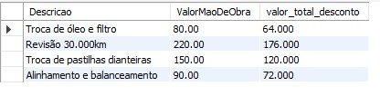

# 📊 Desafio de Projeto - Oficina Mecânica  
Bootcamp **Randstad - Análise de Dados** (DIO)  

Este repositório contém o desenvolvimento de um desafio prático de banco de dados, aplicando conceitos de **modelagem, implementação e consultas SQL** em um cenário de **oficina mecânica**.  

---

## 🔹 Etapa 1 - Modelo Lógico a partir do Conceitual  
A primeira etapa consistiu em transformar o **modelo conceitual** em um **modelo lógico**, definindo as entidades, atributos e relacionamentos da base de dados.  

📌 **Diagrama utilizado como base:**


---

## 🔹 Etapa 2 - Script DDL (Criação do BD e Tabelas)  
Nesta fase, foi desenvolvido o **script DDL** contendo a criação do banco de dados, tabelas e definição das **constraints** (chaves primárias e estrangeiras).  
Esse processo garantiu a integridade referencial e a estrutura correta para suportar os dados da aplicação.  

👉 **Script DDL:**  
```ruby
-- 1. Criar o banco de dados
CREATE DATABASE  oficina_db;
USE oficina_db;

-- 2. Tabelas principais

CREATE TABLE Equipe (
  idEquipe INT AUTO_INCREMENT PRIMARY KEY,
  Codigo VARCHAR(45),
  NomeEquipe VARCHAR(100)
);

CREATE TABLE Cliente (
  idCliente INT AUTO_INCREMENT PRIMARY KEY,
  Tipo_Cliente VARCHAR(20), -- ex: 'PF' ou 'PJ'
  Nome VARCHAR(100) NOT NULL,
  Documento VARCHAR(45),
  Endereco VARCHAR(150),
  Email VARCHAR(100),
  Telefone VARCHAR(45),
  DataNascimento DATE
) ;

CREATE TABLE Veiculo (
  idVeiculo INT AUTO_INCREMENT PRIMARY KEY,
  Placa VARCHAR(20) UNIQUE,
  Marca VARCHAR(50),
  Modelo VARCHAR(50),
  Chassi VARCHAR(100),
  Ano YEAR,
  Cliente_idCliente INT,
  FOREIGN KEY (Cliente_idCliente) REFERENCES Cliente(idCliente)
    ON DELETE SET NULL ON UPDATE CASCADE
) ;

CREATE TABLE Mecanico (
  idMecanico INT AUTO_INCREMENT PRIMARY KEY,
  Codigo VARCHAR(45),
  Nome VARCHAR(100) NOT NULL,
  Telefone VARCHAR(45),
  Especialidade VARCHAR(80),
  CPF VARCHAR(20),
  Endereco VARCHAR(150),
  Equipe_idEquipe INT,
  FOREIGN KEY (Equipe_idEquipe) REFERENCES Equipe(idEquipe)
    ON DELETE SET NULL ON UPDATE CASCADE
);

CREATE TABLE MaoDeObra (
  idMaoDeObra INT AUTO_INCREMENT PRIMARY KEY,
  Descricao VARCHAR(150),
  Valor DECIMAL(10,2) NOT NULL DEFAULT 0.00
);

CREATE TABLE Servicos (
  idServicos INT AUTO_INCREMENT PRIMARY KEY,
  TipoRevisao VARCHAR(100),
  Descricao VARCHAR(150),
  ValorMaoDeObra DECIMAL(10,2) DEFAULT 0.00,
  MaoDeObra_idMaoDeObra INT,
  FOREIGN KEY (MaoDeObra_idMaoDeObra) REFERENCES MaoDeObra(idMaoDeObra)
    ON DELETE SET NULL ON UPDATE CASCADE
);

CREATE TABLE Pecas (
  idPecas INT AUTO_INCREMENT PRIMARY KEY,
  Nome VARCHAR(150),
  Valor DECIMAL(10,2) DEFAULT 0.00
);

-- Tabelas de relacionamento N:N

CREATE TABLE Pecas_has_Servicos (
  Pecas_idPecas INT,
  Servicos_idServicos INT,
  PRIMARY KEY (Pecas_idPecas, Servicos_idServicos),
  FOREIGN KEY (Pecas_idPecas) REFERENCES Pecas(idPecas) ON DELETE CASCADE ON UPDATE CASCADE,
  FOREIGN KEY (Servicos_idServicos) REFERENCES Servicos(idServicos) ON DELETE CASCADE ON UPDATE CASCADE
);

CREATE TABLE OrdemServico (
  idOrdemServico INT AUTO_INCREMENT PRIMARY KEY,
  Numero VARCHAR(45) NOT NULL,
  Status VARCHAR(45),
  DataEmissao DATE,
  DataConclusao DATE,
  Autorizado TINYINT(1) DEFAULT 0,
  DataAutorizacao DATE,
  ValorTotal DECIMAL(12,2) DEFAULT 0.00,
  Veiculo_idVeiculo INT,
  Equipe_idEquipe INT,
  FOREIGN KEY (Veiculo_idVeiculo) REFERENCES Veiculo(idVeiculo) ON DELETE SET NULL ON UPDATE CASCADE,
  FOREIGN KEY (Equipe_idEquipe) REFERENCES Equipe(idEquipe) ON DELETE SET NULL ON UPDATE CASCADE
);


CREATE TABLE Servicos_has_OrdemServico (
  Servicos_idServicos INT,
  OrdemServico_idOrdemServico INT,
  Quantidade INT DEFAULT 1,
  ValorUnitario DECIMAL(10,2) DEFAULT 0.00, -- valor do serviço/mao de obra aplicado nessa ordem
  PRIMARY KEY (Servicos_idServicos, OrdemServico_idOrdemServico),
  FOREIGN KEY (Servicos_idServicos) REFERENCES Servicos(idServicos) ON DELETE CASCADE ON UPDATE CASCADE,
  FOREIGN KEY (OrdemServico_idOrdemServico) REFERENCES OrdemServico(idOrdemServico) ON DELETE CASCADE ON UPDATE CASCADE
);

--  relacionar peças usadas em cada ordem (pecas diretamente na ordem)
CREATE TABLE Pecas_has_OrdemServico (
  Pecas_idPecas INT,
  OrdemServico_idOrdemServico INT,
  Quantidade INT DEFAULT 1,
  ValorUnitario DECIMAL(10,2) DEFAULT 0.00,
  PRIMARY KEY (Pecas_idPecas, OrdemServico_idOrdemServico),
  FOREIGN KEY (Pecas_idPecas) REFERENCES Pecas(idPecas) ON DELETE CASCADE ON UPDATE CASCADE,
  FOREIGN KEY (OrdemServico_idOrdemServico) REFERENCES OrdemServico(idOrdemServico) ON DELETE CASCADE ON UPDATE CASCADE
) ;
````  

---

## 🔹 Etapa 3 - Inserção de Dados para Testes  
Após a modelagem, o banco de dados foi populado com dados fictícios para possibilitar a realização de consultas e testes.  

👉 **Script de inserção de dados:**  

```ruby
-- equipes
INSERT INTO Equipe (Codigo, NomeEquipe) VALUES
('EQ001','Equipe A'),
('EQ002','Equipe B');

-- mecanicos
INSERT INTO Mecanico (Codigo, Nome, Telefone, Especialidade, CPF, Endereco, Equipe_idEquipe) VALUES
('M001','Carlos Silva','(27)9999-0001','Motor','123.456.789-00','Rua A, 123',1),
('M002','Mariana Santos','(27)9999-0002','Eletrica','987.654.321-00','Rua B, 45',1),
('M003','Joao Pereira','(27)9999-0003','Transmissao','111.222.333-44','Rua C, 78',2);

-- clientes
INSERT INTO Cliente (Tipo_Cliente, Nome, Documento, Endereco, Email, Telefone, DataNascimento) VALUES
('PF','Ana Oliveira','123.456.789-10','Av Central, 1','ana@mail.com','(27)98888-0000','1985-06-12'),
('PJ','OficinaX LTDA','12.345.678/0001-99','R. Comercial, 200','contato@oficinax.com','(27)97777-1111',NULL);

-- veiculos
INSERT INTO Veiculo (Placa, Marca, Modelo, Chassi, Ano, Cliente_idCliente) VALUES
('ABC-1234','Fiat','Palio','CHS123456','2015',1),
('XYZ-9876','Ford','Ka','CHS654321','2018',1),
('OFI-0001','Mercedes','Sprinter','CHS999888','2020',2);

-- mao de obra
INSERT INTO MaoDeObra (Descricao, Valor) VALUES
('Troca de oleo', 50.00),
('Revisao completa', 200.00),
('Troca de pastilhas', 120.00);

-- servicos
INSERT INTO Servicos (TipoRevisao, Descricao, ValorMaoDeObra, MaoDeObra_idMaoDeObra) VALUES
('TrocaOleo','Troca de óleo e filtro', 80.00, 1),
('Revisao','Revisão 30.000km', 220.00, 2),
('Freio','Troca de pastilhas dianteiras', 150.00, 3),
('Alinhamento','Alinhamento e balanceamento', 90.00, NULL);

-- pecas
INSERT INTO Pecas (Nome, Valor) VALUES
('Filtro de oleo', 25.00),
('Pastilha dianteira', 80.00),
('Disco de freio', 150.00),
('Filtro de ar', 40.00);

-- relaciona peças <-> serviços
INSERT INTO Pecas_has_Servicos (Pecas_idPecas, Servicos_idServicos) VALUES
(1,1), -- filtro de óleo usado no serviço troca óleo
(4,1), -- filtro de ar usado no troca óleo
(2,3), -- pastilha usada no freio
(3,3); -- disco usado no freio

-- criar ordens de serviço
INSERT INTO OrdemServico (Numero, Status, DataEmissao, DataConclusao, Autorizado, DataAutorizacao, ValorTotal, Veiculo_idVeiculo, Equipe_idEquipe) VALUES
('OS-0001','Concluida','2025-09-01','2025-09-02',1,'2025-09-01',0.00,1,1),
('OS-0002','Em andamento','2025-09-10',NULL,0,NULL,0.00,2,1);

-- associar serviços às ordens (Servicos_has_OrdemServico) com quantidade e valor unitario
INSERT INTO Servicos_has_OrdemServico (Servicos_idServicos, OrdemServico_idOrdemServico, Quantidade, ValorUnitario) VALUES
(1,1,1,80.00),  -- troca de oleo na OS-0001
(3,1,1,150.00), -- freio na OS-0001
(4,2,1,90.00);  -- alinhamento na OS-0002

-- associar peças usadas por ordem
INSERT INTO Pecas_has_OrdemServico (Pecas_idPecas, OrdemServico_idOrdemServico, Quantidade, ValorUnitario) VALUES
(1,1,1,25.00),  -- filtro oleo na OS-0001
(4,1,1,40.00),  -- filtro ar na OS-0001
(2,1,4,80.00);  -- pastilhas (4 unidades) na OS-0001
```

---

## 🔹 Etapa 4 - Queries de Teste  
Por fim, foram elaboradas queries SQL de diferentes níveis de complexidade, utilizando:  
- `JOIN`  
- `ORDER BY`  
- `GROUP BY`  
- `HAVING`  
- `COUNT`  
- e outras funções de agregação.  

Essas consultas validaram a consistência do modelo e demonstraram o potencial de exploração dos dados.  

👉 **Script de queries de teste:**  

- Recuperações simples com SELECT

```ruby
-- Listar todos os clientes e seus emails
SELECT Tipo_Cliente, Nome, Email
FROM Cliente;
```


- Listar todos os mecânicos e suas informações
```ruby
SELECT * FROM Mecanico;
```


- Filtros com declaração WHERE

```ruby
-- Listar veiculos da marca mercedes
SELECT Cliente_idCliente, Modelo, placa, Marca
FROM Veiculo
WHERE Marca = 'Mercedes';
```


```ruby
-- Encontrar serviços acima de R$100,00
SELECT Descricao, ValorMaoDeObra
FROM servicos
WHERE ValorMaoDeObra > '100.00';
```


- Criar expressões para gerar atributos derivados

```ruby
-- Acrescentar 10% de aumento nas peças
SELECT 
Nome,  
Valor,
(Valor + (Valor * 0.1)) AS valor_total 
FROM pecas;
```


```ruby
-- Desconto de  20%  nos serviços
SELECT 
Descricao, 
ValorMaoDeObra,
(ValorMaoDeObra - (ValorMaoDeObra * 0.2)) AS valor_total_desconto
FROM servicos;
```


- Ordenações de dados com ORDER BY

```ruby
-- Ordenar valores de serviços em ordem decrescente
SELECT Descricao, ValorMaoDeObra
FROM servicos
ORDER BY ValorMaoDeObra DESC;
```


```ruby
-- Listar os mecanicos por ordem alfabética
SELECT Nome, Telefone, Especialidade, CPF
FROM Mecanico
ORDER BY Nome;
```


- Top peças mais usadas (JOIN, GROUP BY, COUNT)

```ruby
SELECT p.Nome,
       SUM(pq.Quantidade) AS TotalUsado,
       SUM(pq.Quantidade * pq.ValorUnitario) AS GastoComPeca
FROM Pecas_has_OrdemServico pq
JOIN Pecas p ON pq.Pecas_idPecas = p.idPecas
GROUP BY p.idPecas, p.Nome
ORDER BY TotalUsado DESC;
```


- Quantos serviços foram realizados por ordem? (GROUP BY e HAVING)

```ruby
SELECT os.Numero,
       COUNT(so.Servicos_idServicos) AS QtdeServicos,
       SUM(so.Quantidade * so.ValorUnitario) AS TotalServicos
FROM OrdemServico os
LEFT JOIN Servicos_has_OrdemServico so ON os.idOrdemServico = so.OrdemServico_idOrdemServico
GROUP BY os.idOrdemServico, os.Numero
HAVING COUNT(so.Servicos_idServicos) >= 1
ORDER BY TotalServicos DESC;
```


---

## ✨ Considerações Finais  
Essa jornada foi marcada por **muito estudo, prática e dedicação**, resultando em um aprendizado sólido sobre **modelagem de dados** e **SQL**.  
O desafio agregou de forma significativa à minha **formação em Análise de Dados**, fortalecendo minha capacidade de estruturar e analisar informações de maneira eficiente.  

📌 Conecte-se comigo no [LinkedIn](https://www.linkedin.com/in/ariadinaanascimento/)  

---
